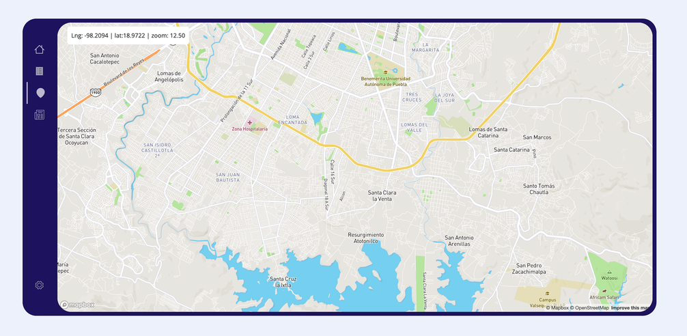

<h1 align="center">
Business Plan App</h1>
<p align="center">
  The first version of <a href="https://business-plan-app.herokuapp.com/" target="_blank">business-plan-app.herokuapp.com</a> built with <a href="https://www.reactjs.org/" target="_blank">React</a> and hosted with <a href="https://www.heroku.com/" target="_blank">Heroku</a>
</p>



## Description

The first version of a business planning web app focused on maximize the efficience in the process of develop a business plan.

## 🛠 Installation & Set Up

1. Install and use the correct version of Node using [NVM](https://github.com/nvm-sh/nvm)

   ```sh
   nvm install
   ```

2. Install dependencies

   ```sh
   npm install
   ```

3. Start the development server

   ```sh
   npm start
   ```

## 🚀 Building and Running for Production

1. Generate a full static production build

   ```sh
   npm build
   ```

<!-- AUTO-GENERATED-CONTENT:END -->
